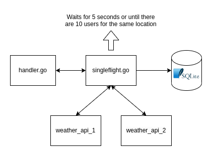

# paribu-case



## Structure
```
.
├── app
│   ├── app.go
│   ├── handler
│   │   ├── handler.go
│   │   └── response.go
│   ├── service
│   │   └── singleflight.go
│   ├── store
│   │   ├── model
│   │   │   └── weather.go
│   │   ├── sqlite.go
│   │   └── weather.go
│   └── weather
│       └── weather.go
└── config
    └── config.go
```

## API
#### /weather
* `GET` : /weather?q=\<location\>
#### Response:
```json
{
  "location"    : "<location>",
  "temperature" : "<average-temp>"
}
```

## Run
```bash
go run main.go 
#visit 0.0.0.0:3000/weather?q=Istanbul on browser
```

"weather_api_1" and "weather_api_2" not working. Instead, it generates fake data.